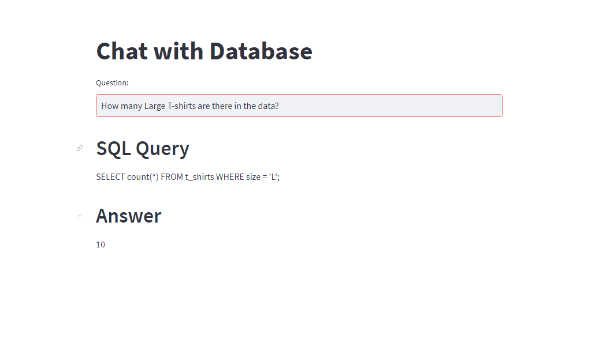

# Chat with the SQL Database

## Overview
"Chat with the SQL Database" leverages a Large Language Model (LLM) to facilitate interactive, natural language conversations with a SQL database. 
This application aims to make database interactions more intuitive and accessible for users of all technical levels.

## Features
- **Natural Language Queries**: Users can make queries in natural language, and the system translates these into SQL commands.
- **Response Generation**: The application generates responses based on the data retrieved from the SQL database.
- **Interactive Learning**: Leveraging the LLM's capabilities, the system can improve its understanding of user queries over time. It has some semantic capabilities as well.

## Installation
1. **Clone the repository**:
   ```sh
   git clone https://github.com/hrpatil273/chat-with-mysql-database.git
   ```

2. **Navigate to the project directory**:
   ```sh
   cd chat-with-mysql-database
   ```
3. **Creating Database : Run MySQL server(XAMPP/MySQL workbench) and execute `database.sql` file.**

4. **Install dependencies**:
   ```sh
   pip install -r requirements.txt
   ```

## Usage
- **Start the application**:
  ```sh
  Streamlit run app.py
  ```
